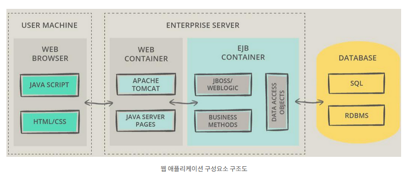

# 01_웹어플리케이션이란

```javascript

var 하트, 채워진하트;
// 아이디 선택
하트 = document.getElementById("heart");
채워진하트 = document.getElementById("fill-heart");
// 하트에 이벤트 추가하기 
// 클릭되었을때
하트.addEventListener("click", function() {
    // 사용자에게 어떻게 보여질 것인지 
    하트.style.display = "none";
    채워진하트.style.display = "block";
})
// 반대 동작 
채워진하트.addEventListener("click", function() {
    // 사용자에게 어떻게 보여질 것인지 
    채워진하트.style.display = "none";
    하트.style.display = "block";
})

```

> 동적인 것을 활용하여 웹 어플리케이션 처럼 
>
> 웹 애플리케이션을 이용하는 사용자의 요구에 따라 
>
> 웹에서 다른 이용자에게 메시지를 보내거나 
>
> 댓글을 다는 등의 애플리케이션이 동작해야 한다. 

> ##### 사용자와 대화하는 식으로 기능을 수행


---


##### 웹어플리케이션

> 웹 브라우저의 요청에 대하여 처리해서 결과를 보여주는 프로그램을 의미한다. 


##### 웹 어플리케이션의 구성요소 

1. 웹 브라우저 

   * 사용자에게 화면(UI)를 제공한다. 
   * 종류 : IE/Edge/Chrome/Firefox 등 

   

2. 웹 서버 

   * HTTP를 통해 웹 브라우저와 같은 클라이언트에서 요청하는 HTML 문서나 CSS, JS, 오브젝트 등의 웹 페이지를 전송해 주는 서비스 프로그램이다. 
   * HTTP 프로토콜을 기반으로 브라우저 요청을 서비스하는 기능을 담당한다. 
   * 종류 : 아파치 서버, IIS, 엔진X, GWS 등

   

3. WAS(Web Application Server)

   * 인터넷 상에서 HTTP를 통해 사용자 컴퓨터나 장치에 애플리케이션을 수행해주는 미들웨어(소프트웨어 엔진)
   * 서버단에서 APPLICATION을 동작할 수 있도록 지원한다. 
   * 웹 애플리케이션 서버는 동적 서버 컨텐츠를 수행하는 것으로 일반적인 정적 콘텐츠를 수행하는 웹서버와 구별된다. 
   * 주로 데이터베이스 서버와 같이 수행된다. 
   * 종류 : 아파치 톰켓, 레진, 제이런, 제우스, 웹 로직 등등 


4. 데이터 베이스 
   * 웹 어플리케이션이 필요한 데이터를 저장한다. 




##### 웹 애플리케이션 종류

> Servlet, JSP(Java Server Pages), 기타 


1. Servlet
   1. 서버에서 웹 페이지 등을 동적으로 생성하거나 데이터 처리를 수행하기 위해 자바로 작성된 프로그램이다.
   2. 자바 서블릿인 서버 측 기능을 확장시킨 자바 프로그램으로 자바EE의 한 기능이다
   3. 서빌릿은 자바 코드 안에 HTML을 포함하고 있어서 그 효율성이 떨어진다.
2. JSP(Java Server Pages)
   1. JSP는 HTML 내에 자바코드를 삽입하여 웹서버에서 동적으로 웹 페이지를 생성하여 웹 브라우저에게 돌려주는 언어이다.
3. 기타 
   1. CGI : 웹서버에 있어 사용자의 요구를 응용프로그램에 전달하고 그 결과를 사용자에게 돌려주기위한 표준적인 방법
   2. ASP : MS사에서 개발된 웹 애플리케이션으로 동적 콘텐츠 개발위한 기술이다.
   3. PHP: 동적 웹 페이지를 제공하는 것을 목적으로 하는 서버측 스크립트 언어이자 범용 프로그래밍 언어이다.