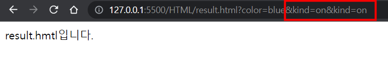
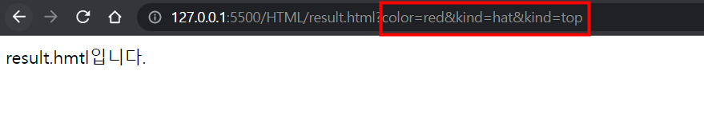
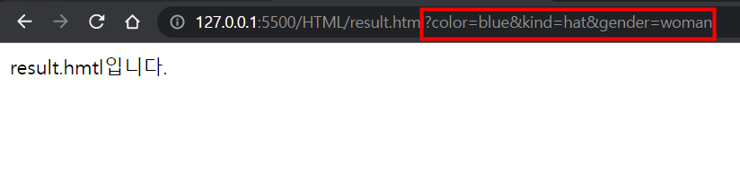

# 06_다중선택을 위한 checkbox와 단일 선택을 위한 radio


```html
<!-- 다중선택 -->
        <div>
            모자 : <input type="checkbox" name="kind">
            상의 : <input type="checkbox" name="kind">
            하의 : <input type="checkbox" name="kind">
            양말 : <input type="checkbox" name="kind">
        </div>
```




```html
<!-- 다중선택 -->
        <div>
            모자 : <input type="checkbox" name="kind" value="hat">
            상의 : <input type="checkbox" name="kind" value="top">
            하의 : <input type="checkbox" name="kind" value="bottom">
            양말 : <input type="checkbox" name="kind" value="socks">
        </div>
```



```html
<!-- 성별_반드시 하나의 값만 선택할 수 있도록 만들기 : radio -->
        <div>
            남자 : <input type="radio" name="gender" value="man">
            여자 : <input type="radio" name="gender" value="woman">
        </div>

```

