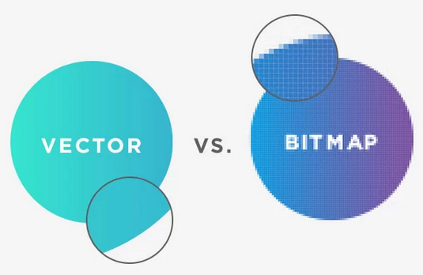

# 10_이모티콘 같은 문자는 svg 태그 

```html
<input type="button" value="버튼">
```

```html
<button>버튼</button>
```

> * ##### 가장 큰 차이점 
>
>   * `button` 태그의 컨텐츠로 `버튼` 을 주는 것 
>   * `input` 태그는 value로 `버튼` 을 주는 것 

```html
<button>
        <p>다른 태그</p>
        <p>동작</p>
</button>
```

> `button` 태그는 안에 다른 태그를 넣어도 가능하다. 
>
> > 즉, button 태그에 이미지 태그도 넣을 수 있다. 
> >
> > `img`  태그를 넣고자 할 때 이모티콘으로, svg 많이 사용한다. 


### 🤔 svg

* #### vector data `vs` bitmap data

