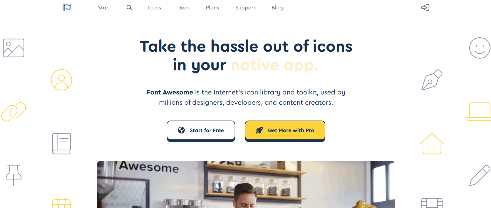
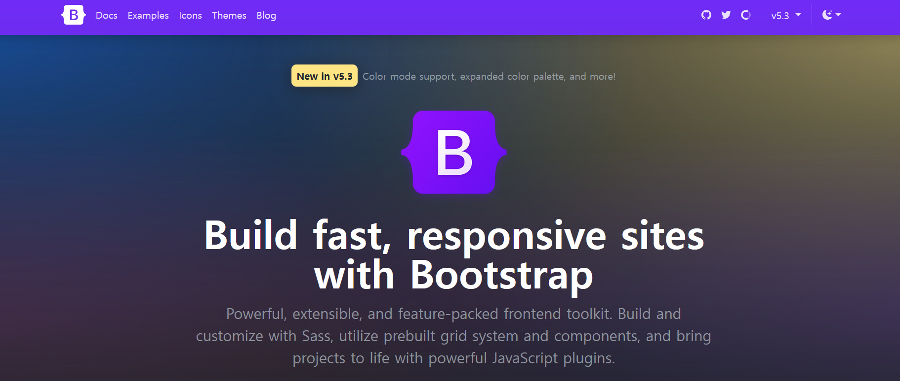
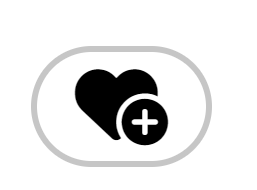

# 11_i 태그의 재활용

## fontawesome, bootstrap







> `link` 태그로 cdn 방식으로 가져오기 
>
> > 장단점 생각해보기 


---


```html
    <link rel="stylesheet" href="https://cdnjs.cloudflare.com/ajax/libs/font-awesome/6.2.1/css/all.min.css" integrity="sha512-MV7K8+y+gLIBoVD59lQIYicR65iaqukzvf/nwasF0nqhPay5w/9lJmVM2hMDcnK1OnMGCdVK+iQrJ7lzPJQd1w==" crossorigin="anonymous" referrerpolicy="no-referrer" />

```

```css
    <style>
        button {
            background-color: white;
            border: 1px solid #c6c6c6;
            border-radius: 15px;
        }
    </style>
```

```html
 <button>
        <i class="fa-solid fa-heart-circle-plus"></i>
    </button>
```





---


